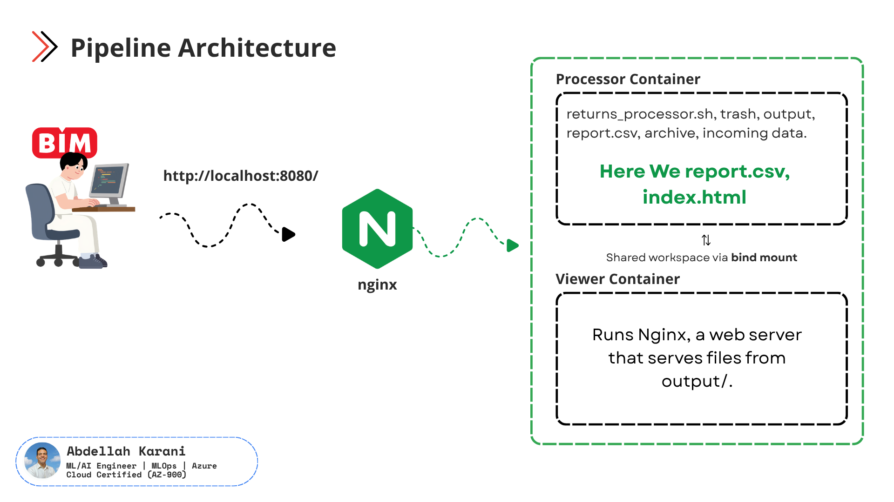
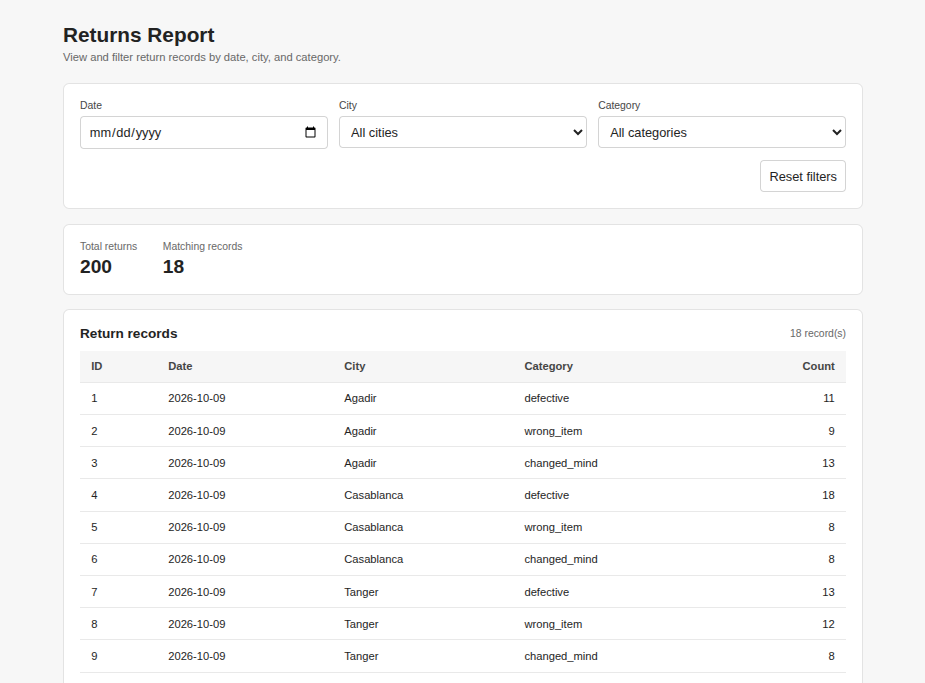

Bim (company in morocco) send me data every day. and I develop a pipelines that read the data from source to display in html file.

So I use two Docker containers:
- **Processor**: runs a shell script every 10 seconds and creates a report.
- **Viewer**: an Nginx web server that shows the report in my browser.

---

## Pipeline Architecture



How it works:

1. You open `http://localhost:8080/` in your browser.
2. Nginx receives the request.
3. Nginx serves the files from the `output/` folder (`report.csv` and `index.html`).
4. The Processor container writes new results into the same folder.

The two containers share files using a **bind mount**. This means a folder on my computer is made available inside the container.

---

## What You Will See



This is the web page served by Nginx. It shows the report made by the processor.

---

## Project Files

| File / Folder | What it does |
|---|---|
| `returns_processor.sh` | The shell script that processes the data |
| `incoming data` (`input/`) | The data the script reads |
| `output/` | Where `report.csv` is saved |
| `trash`, `archive` | Folders used by the script for handled files |
| `viewer/index.html` | The web page |
| `viewer/viewer.conf` | The Nginx settings |
| `Dockerfile` | Builds the processor container |
| `docker-compose.yml` | Starts both containers together |

---

## The Two Services

### 1. Processor

Built from the `Dockerfile`:

- Starts from a small Linux system: `alpine:3.14`.
- Installs `bash`, `gawk` and `coreutils`.
- Uses `/app` as the working folder.
- Copies the script, the viewer files and the input files into `/app`.
- Makes the script runnable with `chmod +x`.
- Runs the script in a loop, **every 10 seconds**:

```
while true; do ./returns_processor.sh; sleep 10; done
```

In `docker-compose.yml`, the line `.:/app` takes the current folder from my computer and makes it available inside `/app` in the container.

### 2. Viewer

Uses the ready-made image `nginx:alpine`. It has three mounts, all **read-only** (`:ro`):

| On my computer | In the container | Purpose |
|---|---|---|
| `./viewer` | `/usr/share/nginx/viewer` | `index.html` is here |
| `./output` | `/usr/share/nginx/output` | `report.csv` is here |
| `./viewer/viewer.conf` | `/etc/nginx/conf.d/default.conf` | Nginx settings |

Port `8080:80` means: port **8080** on my computer goes to port **80** in the Nginx container.

---

## How to Run

1. Install Docker and Docker Compose.
2. Open a terminal in the project folder.
3. Start everything:

```
docker compose up --build
```

4. Open your browser and go to:

```
http://localhost:8080/
```

5. To stop the project, press `Ctrl + C`, then run:

```
docker compose down
```

---

## Notes !

- The report updates every 10 seconds. Refresh the page to see the new data.

---

Made With <3 by **Abdellah Karani**
